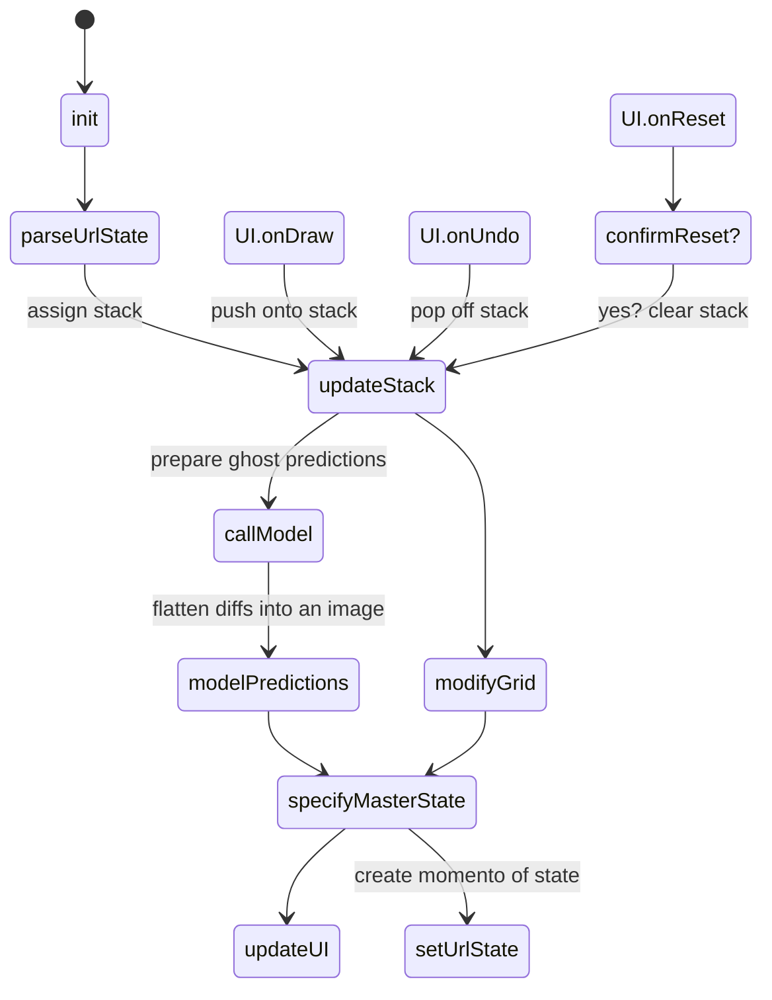
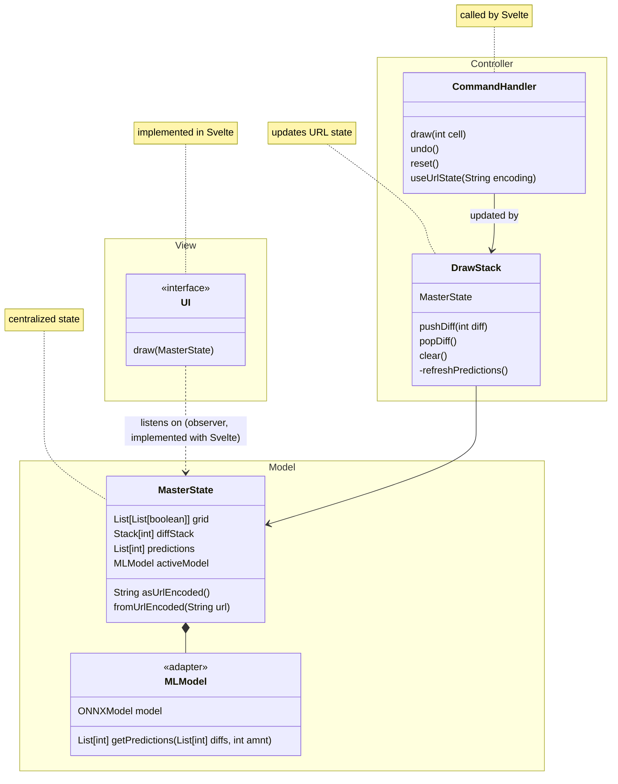
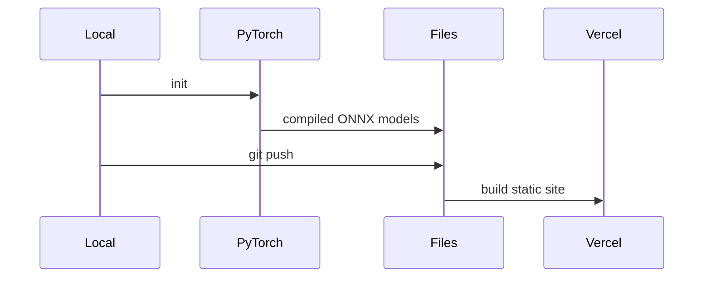
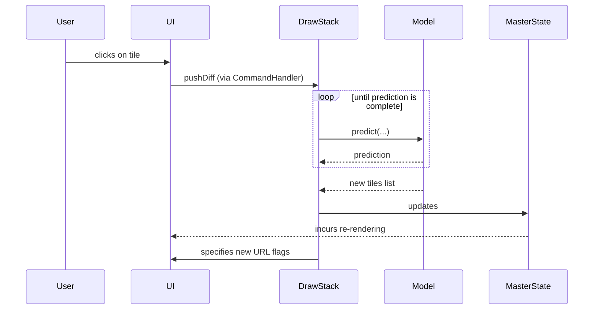
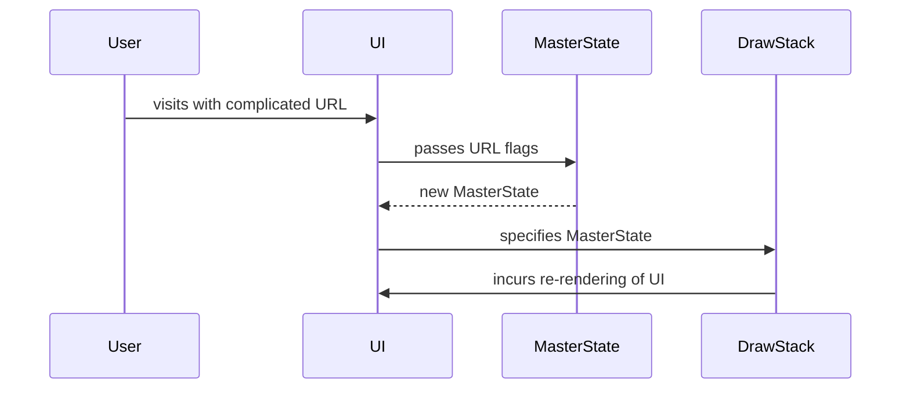
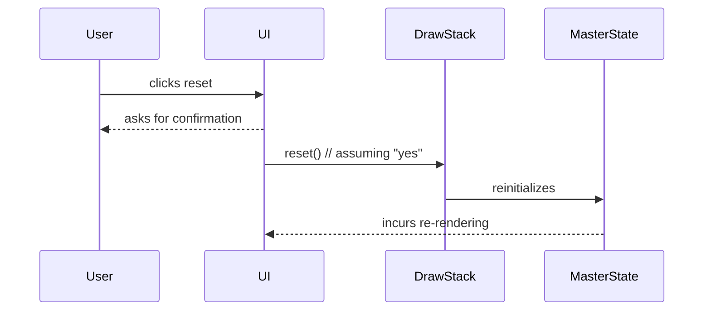

> Simon Walker
> July 9th, 2025

# Latent Canvas
How clever is AI at finding patterns? Latent Canvas explores the intersection of human creativity and machine wit through a "pictorial autocomplete". The tool consists of a simple grid of cells. The user can draw, and as they do, a transformer (AI) attempts to predict their next moves. In the browser, a transformer will be trained in real-time, providing its best guess as a "ghost" image overlayed over the grid. It's an exploration of AI capabilities. Users can peer into mind of the system to get a feel for the types of patterns it prefers or is unable to detect. And practitioners can develop intuition for limitations. User's can experiment with the AI and conveniently export their intriguing patterns with a shareable URL.

The workflow consists of essential features:
- drawing: interactive grid of boolean tiles
- undo
- reset
- shareable URL based import/export

The system will not be designed with the ambition to be useful for creative generation. The tool should be seen as educational and experimental. The goal is to provide a window into the model's memory and pattern recognition abilities.

## Project Requirements
### **1. System Goals and Core Responsibilities**
- **Core Goal:** To allow users to intuitively "feel" how a transformer model learns and predicts patterns by providing real-time visual feedback on a user's drawing.
- **System Responsibilities:**
    - **Provide an Interactive Canvas:** The system must offer a simple, intuitive interface for users to create patterns on the grid.
    - **Perform In-Browser AI Training & Inference:** The system is responsible for running a machine learning model directly in the browser, continuously re-training it on the user's input, and using it to generate predictions.
    - **Visualize AI Predictions:** The system must render the AI's predictions in a clear, non-intrusive manner that complements the user's drawing process.
    - **Enable Stateless Sharing:** The system must provide a mechanism for users to save, export, and share their creations easily (without requiring user accounts or a backend database).
### **2. Functional Requirements**
These are the specific capabilities the system must provide to the user.
1. **Grid-Based Drawing**
    1. The system must provide a 16x16 grid of boolean (on/off) cells.
    2. Users should be able to enable the state of any cell by clicking (desktop) or tapping (touch devices).
    3. Users should be able to toggle multiple cells by dragging the cursor/finger across the grid.
2. **Real-Time AI Prediction**
    1. The system must treat the user's drawing as a sequence of activated cells.
    2. The system must use a pre-compiled transformer model (in ONNX format) to predict the most probable next cell in the sequence.
    3. This prediction must be displayed visually on the grid as a distinct "ghost" image (a semi-transparent cell).
    4. The prediction must update in near real-time as the user modifies the drawing or provide an indicator that the model is "thinking" (still processing).
3. **Canvas & State Controls**
    1. **Undo:** The system must provide an "Undo" function to revert the most recent grid change.
    2. **Reset:** The system must provide a "Reset" function to clear the entire grid. This action should require user confirmation to prevent accidental data loss.
4. **Session Portability (Sharing)**
    1. The system shall provide a "Share" function that encodes the entire state of the grid into a query parameter in the page URL.
    2. The system must be able to parse a valid grid state from a URL on page load and render the corresponding drawing.
### **3. Non-Functional Requirements**
1. **Performance**
	- **UI Responsiveness:** All direct user interactions (drawing, clicking buttons) must feel fast, with a visual response.
		1. **Prediction Latency:** The AI's "ghost" prediction should either appear immediately or activate a loading indicator immediately after the user's last action.
		2. **Resource Efficiency:** The application must run smoothly in modern web browsers without causing excessive CPU/memory load or drain on mobile devices.
2. **Usability**
	- **Learnability:** The interface must be intuitive and should require no external instruction for a first-time user.
	- **Accessibility:** The tool must be fully functional on both desktop and mobile devices. Visuals (colors, contrasts) should be clear and legible.
3. **Reliability**
	- **Error Handling:** The system must gracefully handle potential errors, such as an invalid/malformed shared URL, without crashing or freezing.
### **4. Constraints**
These are limitations or restrictions that shape the design and development of the system.
- **Client-Side Execution:** The entire application, including all AI model operations, must run on the client-side within the web browser. No backend server is to be used for computation. This is because I do not want to pay for a server.
- **Fixed Model Architecture:** The AI model will be designed and compiled into the ONNX format beforehand. The user cannot alter the model's architecture (such as number of parameters) at runtime. This can be partially mitigated by preparing hyperparameter presets.
- **Limited Complexity:** The drawing grid is fixed at a small size (16x16) to ensure performance constraints for in-browser training can be met.
- **Stateless Persistence:** The application will not use a database or user accounts. The only method for saving and sharing a drawing is via URL encoding.
- **Single-User Focus:** The interaction model is designed for a single user. Collaboration is limited to the asynchronous sharing of canvas states via URLs.
## Users and Tasks
### **Latent Canvas: User and Task Analysis**
### **1. User Personas**
Two primary types of users are anticipated.
- **The Casual Explorer:** This user is curious about AI and its creative potential. They are not necessarily technical but are intrigued by the idea of a machine predicting their drawing.
    - **Goals:** To have a fun, playful interaction. To see how the AI responds to different simple inputs (lines, dots, shapes). To be surprised by the AI's ability to see patterns.
- **The AI/ML Practitioner/Student:** This user has a background in technology, specifically machine learning. They are interested in gaining a more intuitive understanding of how transformer models learn and where their limitations lie.
    - **Goals:** To test the model's ability to recognize various patterns (symmetry, repetition, sequences, curves). To observe how quickly the model adapts to a new pattern. To "break" the model by drawing patterns it cannot predict. To use the tool as an educational resource to visualize model behavior.
### **2. Use Cases**
The following use cases detail the core interactions a user will have with the system.
#### **Use Case 1: Create a Drawing**
- **Actor(s):** All User Personas (Casual Explorer, Practitioner)
- **Description:** The user interacts with the grid to create a visual pattern, and the system provides real-time predictions.
- **Basic Flow (Happy Path):**
    1. The user arrives at the Latent Canvas web page.
    2. The system presents a blank 16x16 grid.
    3. The user clicks or drags their mouse over the grid cells.
    4. Each clicked cell lights up as if painted
    5. After each new cell is activated, the system's AI model processes the current grid state.
    6. The system displays the AI's prediction for the user's _next_ move as a "ghost" image (a semi-transparent gray cell) on the grid.
    7. The user can continue clicking cells to build their drawing, with the ghost prediction updating continuously.
- **Alternative Flows & Exceptions (WAVE):**
    - **(Various) The AI model is slow to respond.** The ghost prediction may lag slightly behind the user's drawing action. The UI should feel responsive, even if the prediction takes a moment to appear. A loading indicator may be necessary depending on performance.
#### **Use Case 2: Undo the Last Action**
- **Actor(s):** All User Personas
- **Description:** The user reverses their most recent drawing action (toggling a cell on or off).
- **Basic Flow (Happy Path):**
    1. The user has made at least one change to the grid.
    2. The user clicks the "Undo" button.
    3. The system reverts the last cell toggle to its previous state.
    4. The AI model updates its prediction based on the new (reverted) grid state.
- **Alternative Flows & Exceptions (WAVE):**
    - **(What-if) The user clicks "Undo" multiple times?** The system will continue to revert actions in reverse chronological order until the grid is back to its initial state.
    - **(Alternative) The grid is already blank.** The "Undo" button is disabled or has no effect if clicked.
    - **(Exceptional) The user clicks "Undo" very rapidly.** The system should handle the requests sequentially and not enter an inconsistent state.
#### **Use Case 3: Reset the Canvas**
- **Actor(s):** All User Personas
- **Description:** The user clears the entire grid to start a new drawing from scratch.
- **Basic Flow (Happy Path):**
    1. The user has made some changes to the grid.
    2. The user clicks the "Reset" button.
    3. The system displays a confirmation prompt
    4. The user confirms the action.
    5. The system clears all "on" cells, returning the grid to its blank state.
    6. The AI's ghost prediction is removed.
- **Alternative Flows & Exceptions (WAVE):**
    - **(What-if) The user decides not to reset?** The user can cancel the action at the confirmation prompt, and the grid remains unchanged.
    - **(Alternative) The grid is already empty.** The "Reset" button is disabled or has no effect if clicked.
#### **Use Case 4: Share a Drawing**
- **Actor(s):** All User Personas
- **Description:** The user generates a unique URL that encodes their current drawing, allowing them to save it or share it with others.
- **Basic Flow (Happy Path):**
    1. The user has created a drawing they wish to share.
    2. The system encodes the current state of the grid (the sequence of "on" cells) into a URL parameter.
    3. The browser's URL is updated with this new parameter.
    4. The user copies the URL, to be shared with another user.
- **Alternative Flows & Exceptions (WAVE):**
    - **(What-if) Another user opens a shared URL?** When a user navigates to a URL containing the drawing data, the system parses the URL, decodes the grid state, and immediately displays the shared drawing on the canvas upon page load. The AI then generates its prediction based on this loaded pattern.
    - **(Exceptional) The shared URL is malformed or invalid.** If the system cannot parse the data from the URL, it will default to loading a blank canvas and ignore the invalid data. It will not crash.
## Storage
This app is entirely hosted in the browser and requires no persistent state in local storage or on the user's host machine -- everything in memory. However, to enable **URL Sharing** between users, most of the system state is serialized into a dense form, URL encoded, and packed into the URL flags. This lets the URL (visible to the user) mirror the source of truth (in memory).

The state encoded into the URL is parsed immediately upon first visiting the site and is used to populate nearly all of the internal state (to initialize the `MasterState`) using the momento pattern (a deserialization step).
### URL State Schema
**(JSON)** encoded into a web-safe form:
- model_id: int
- stack: int

`model_id` is zero. It is included to account for the possibility of multiple types of models (which could be added as time allows), in which case it would be a small integer ID.

#### Stack representation
The stack, used to represent the sequence of pixels the user as colored, is represented as a: `List[int]` where each element of the list corresponds to a pixel ID. For example, for a 16x16 sized canvas and if the user draws on the first two pixels in the first row and the first pixel in the second row, we'd expect the stack to be `[0, 1, 16]`.
###### Dense serialization
Each element in the stack, for a 16x16 is in range $[0, 256)$ which can be stored in a single (8-bit) byte. Thus the entire list can be bit-packed into a single number by stacking the bits. Parsing this form back into the original list requires knowing the size of the list. For simplicity, the size is stored in the first 4 bits.

This process results in a single large integer representing the entire stack. This is then encoded into String form using hex.

---
This schema may need to be adjusted in a minor way depending on size of the URL.
## System State

The four primary functions (draw, undo, reset, shareURL) have an implementation that is traceable starting from the states on the second layer (from the top of the diagram). Namely: `parseUrlState`, `UI.onDraw`, `UI.onUndo`, and `UI.onReset`/`confirmReset`.

All actions have a similar path through the state machine because they all incur updates to the internal "draw stack" which will cause a series of dependent values to update.

The share URL feature does not have an associated event because there is no explicit trigger. The URL sharing functionality is entirely automatic -- the URL updates as the state updates and the state updates as the URL updates.
## UI Mocks

## Class Diagram

There are four primary patterns present here in a subtle way. Svelte is a fundamentally reactive framework which implements an observer pattern automatically. With respect to the browser, updates UI elements lazily, and simultaneously listens on the internal state for changes.

The overall system implements a MVC architecture where Svelte is entirely responsible for *view* and calls the *controller* while simultaneously listening (observer) on the *model*; this capability simplifies development.

As the UI receives actions from the user's, simple commands are handled by the underlying system. The UI does not directly mutate the core state.

The underlying ONNX based ML model requires specialized tensor datatypes as a parameter and produces tokens as an output. To make this compatible with the rest of the state and renderable by the UI, an adapter permanently wraps the ONNX model.

The URL sharing functionality requires serialization and deserialization of the private state of the `MasterState`. To maintain encapsulation, the momento pattern is used in the sense that the momento is the serialized String representation of the `MasterState`.
## Sequence Diagrams
### Deployment
The machine learning model complicates deployment with an extra compilation step.

Notice that the ONNX Model files are compiled in a separate workflow from the overall app. The Python backend's only purpose is to perform this compilation step.
### Draw/Undo Happy Path
This path concerns the case where a user clicks on a tile as to "draw". The system updates the internal state after requesting new predictions from the ML model.

Note that the user action `Undo` has an identical structure except that instead of calling `pushDiff`, we call `popDiff`. Subsequent calls remain.

Internally, the `DrawStack` maintains the total list of pixels colored in a stack and simultaneously, the flattened image state. After fetching the model's prediction of the sequence, the predictions and image are returned to the UI for rendering.

Due to the fact that this path incurs a change to the MasterState, it is necessary to automatically update the URL flags in case a user decides to share the URL.
### URL Sharing
URL Sharing is mostly invisible to the user because updating the state automatically changes the URL and visiting a URL from a friend causes the encoded state to load.

In the previous happy path regarding the case of the user drawing on tiles, the URL flags are updated as changes are made to the internal state. This diagram concerns the case for when a user first visits the site with a URL that already has flags.

Note that it may not be possible to initialize a `MasterState` given the URL flags if they were invalid. In this case the path abruptly ends: the default `MasterState` is used and the flags are thrown out.
### Reset
Reset involves clearing the current drawing after confirmation, and re-rendering the UI accordingly.

