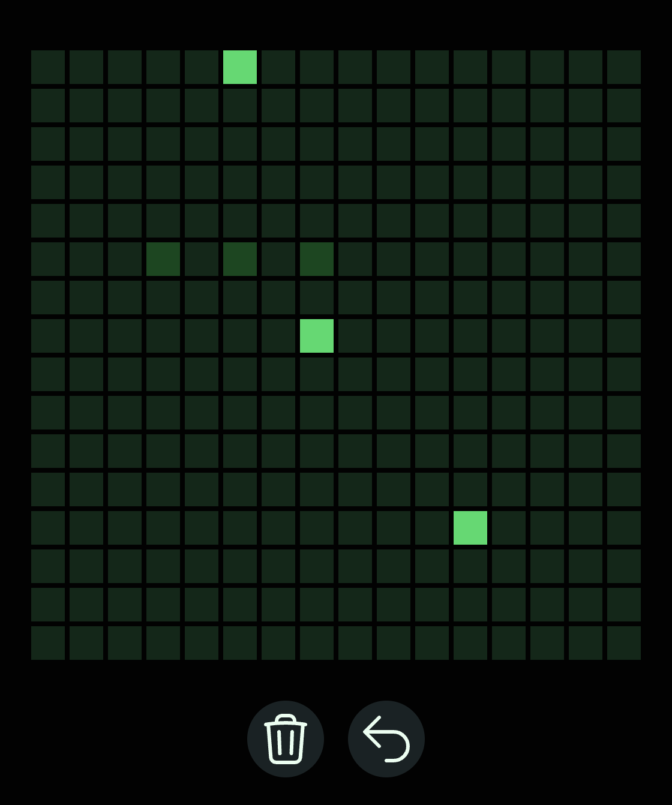

Simon Walker
July 23rd, 2025
# Latent Canvas, Final Report
See it for yourself.
[https://latent-canvas.vercel.app/](https://latent-canvas.vercel.app/)

See the [design](md/design.md)
## Building the project
1. Get the dependencies. This project requires `bun` or `node`.
    - If you use nix-direnv, just cd in. If you only use nix, `nix develop` to provide `bun`.
2. Install libraries. `bun i`
3. Serve the site. `bun run dev`

To compile the ML model, visit `py/`
1. Then, run the export script with `uv run export.py` which will produce `artifacts/pixel_transformer.onnx`
## Final summary
Features implemented
- ML Model design & tuning
- ML Model integration
- Automatic save/load of state into the URL
- Model predictions rendered on canvas
- Refactors to account for increased complexity

Catastrophic issues and missing features
- The ML model was ultimately NOT integrated. It was (very unfortunately) replaced with a dummy version that produces random guesses.
	- The model integration was initially intended to be done with ONNX. Compilation into the ONNX format took several hours due to discovery of a bug in their system. After finding a workaround, more hours were lost attempting to execute the model in the browser -- cryptic errors like "Error 1184949". Ultimately, the API turned out to be incomplete for my project language (TS).
	- To mitigate the integration issue, I educated myself on serverless functions in an attempt to put the python code related to the model on the server.  But after a few hours of failed attempts to integrate vercel, this was reluctantly abandoned.

All primary use cases were implemented as stated in the design. However, the integration issue has eliminated the only use of the tool, to my dismay.
## Class diagram
Note that `Coord` is a simple utility class that holds and x and y, integer, coordinate. It is omitted from the diagram for better clarity.

### Design patterns
- MVC
	- 'View' components are annotated with UI
	- The model & controller are largely integrated. `MasterState` both system state and provides the methods to control it in an encapsulated way.
- Adapter
	- The ML model operates input/output in vectors but the rest of the system uses `Coord`inates. Additionally the model needs to run multiple times to produce a useful output. To simplify its usage, an adapter is utilized.
- Momento
	- To save/load the primary field of the `MasterState`, `GridStack`, the state is de/serialized and stored/loaded with the momento pattern. The data itself is stored in the URL flags.
- Observer
	- Svelte (UI framework) makes this one subtle. The UI listens on anything annotated with `$state` and `$derived`. Major components of the model (MVC) are subscribed on by the UI.
- Command
	- As the user performs actions, their actions reverberate upwards through a series of callbacks until ultimately the `MasterState` executes the action and updates the state.
### Comparison
**Pervious Class Diagram**

**Changes**
	While the overall structure is extremely similar, modularizing the state and the dependencies became more clear during development. This allowed me to improve cohesion and reduce coupling. Additionally, there was some unanticipated complexity -- the ML model required an adapter layer and it made more sense for `MasterState`, which is fairly abstract, to rely on an `MLModel` interface.
## Outside work
**System dependencies**
- Frontend (typescript)
	- SvelteKit
	- TaildwindCSS
	- Vercel
- Backend (python, model compilation)
	- PyTorch
	- ONNX Runtime

Frontend packages supported the speed of development and codebase simplicity.

Backend packages made ML model development, and export, possible.

No outside code was used except for that found in the documentation of these libraries.

**AI Use**

AI was occasionally used in all phases as a basic research or preliminary debugging tool, but did not write any major components.

However, after the model was developed in python and during integration hell, AI was used to entirely generate `pixelTransformer.ts_` which was a reimplementation of the core ML system in a different language and framework. It did not end up used in the final product.
## Statement on process
- *GOOD:*  knowledge of design patterns (such as momento pattern) altered my development style in a way different than I would have done naturally. I would have considered the save/load feature to be something to implement as a few extra methods on the state class. Instead, utilizing a separate object (the momento) improved clarity and abstraction.
- *GOOD:*  diagramming the system reveals the ease of avoiding design flaws in an implementation partially complete. It's faster to iterate on the design in the high-level, then, move to the implementation phase.
- *BAD:*  due to the nature of the class, I attempted to make my code smoewhat java-esque. In my opinion, this leads to medicore code for this language which has many more possibilities that would appear radical from the java perspective. TS programmers use the prototype pattern in a flexibly-typed way prolifically. Modules are used often and a significant minority of TS developers consider using classes at all to be bad practice in this language.
## Demo
1. First, we visit https://latent-canvas.vercel.app/

It may look chaotic at first, but...

2. We draw an image by clicking or dragging over the tiles.

The medium colored pixels represent "drawn" pixels. Notice that the brightly colored pixels changed places from the last image. This is because these represent the predictions that the AI system is making as we draw our image. Since the image changed, so did the predictions.

But due extreme issues with wasm-based ML execution libraries, I am disappointed to say that while I did engineer an ML model to predict reasonably, it was not integrated into the system. The brightly colored pixels seen in this image are the result of random. In my experimentation with the intelligent model, it was able to successfully recognize basic structures and continue them.

3. We can clear the grid with the trash can.

Clicking "Erase the board"...

It now lacks the recently drawn pixels and the default pixels.

4. If we make a mistake, we can use the undo button. (First, some sample pixels)

And pressing the undo button one time...

5. Simultaneously while we've been updating the grid. The URL has been changing. 

It was: `https://latent-canvas.vercel.app`  

It is now: `https://latent-canvas.vercel.app/?grid=%255B83%252C85%255D`

If you visit the second URL on your device, it will look the same as in the photo, but likely with different AI predictions (light green tiles). This is because the changes we make are captured in the URL state (`%255B83%252C85%255D`)

6. Lastly, there is mobile support. The UI will adjust to utilize space reasonably. If we make the screen larger:

When it is small, the buttons go under the canvas.

When it is large, the buttons go beside the canvas.

Thank you!
