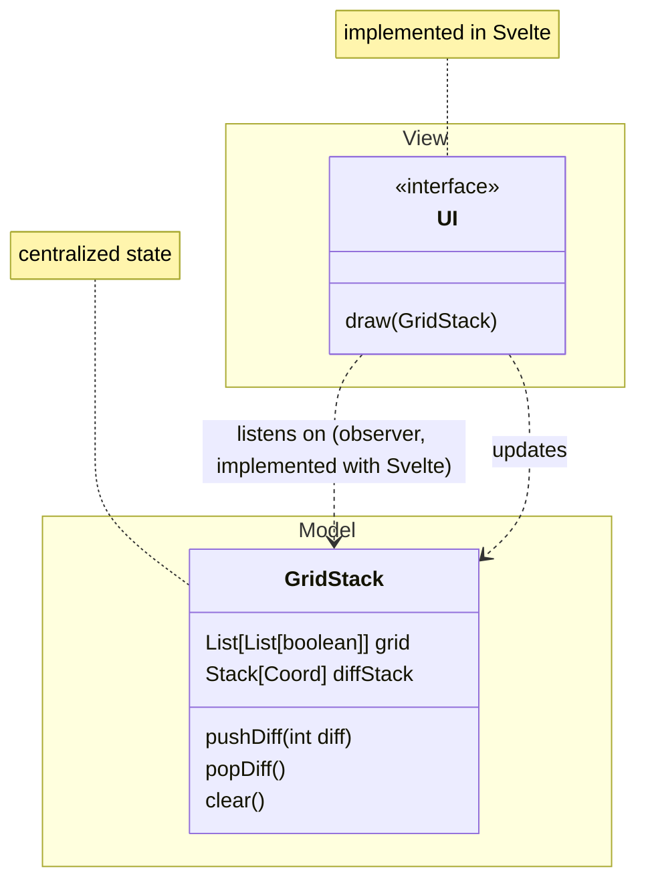

> Simon Walker
> July 16th, 2025

# Latent Canvas Progress

**Video:**
[ProgressVideo](./progress.mp4)
## Accomplished
- UI
   - UI functional, ready for model integration
   - UI themeing and animation
   - Responsive design
- MVC: model/UI/controller loop working
  - UI is reacting on changes to state
- Delete & Undo mechanics
  - CtrlZ to Undo
  - "Are you sure you want to delete?" modal
  - Undo feature required an actions stack to be maintained

Progress so far has been entirely oriented around building the UI in a functional and stable way as
to accomodate arbitrary changes in state. This robust reactivity requires some nuance in the UI
design because when elements update, animations need to know which of the old elements correspond to
the next. The system is ready for AI integration.
### Issues

In the initial design, the `DrawStack` separately maintained the operations stack from the grid
state. While this breaks the system into small components, the better design is to merge
`MasterState` and `DrawStack` into one entity. This is due to the fact that their state needs to be
encapsulated under a single class to prevent inconsistenties between them.

The `CommandHandler` so far seems to be too simple to require its own class because Svelte
simplifies the UI/model coupling -- the controller is implicit. There are still explicit callbacks
that nested components of the UI call which implement the command pattern.
### Patterns
Svelte handles the coupling between the view (UI) and model (state) in a very high level way
that lets the controller be implicit, but the general separation of model/view/controller and
the corresponding information flow is there. The UI is implemented in `.svelte` files with
minimal internal logic except that essential to UI. The model is currently housed in
  [gridStack.svelte.ts](../src/lib/gridStack.svelte.ts). The UI listens on model changes
automatically by utilizing Svelte to solve the dependency graph and generate the observer pattern
where necessary. Svelte traces changes in state to update the UI by starting with `$state(...)`
values and following their usage. The "controller" is implemented in the form of callbacks passed
from the model to the UI for the UI to execute. This allows the UI to modify the model in a
strongly decoupled way. For example, [+page.svelte](../src/routes/+page.svelte) passes `{onUndo}` or `{onDelete}` to components which when called update the model.

- MVC:  UI --Svelte calls callback--> Model Update --Svelte implements observers--> UI
  - The UI reactivity on backing state is implicit, see the above.
  - The "controller" (which updates the state) executes callbacks passed at initialization that
  update the state as the user engages with the UI.
- Observer:  The UI updates based on state changes using the observer pattern implicitly,
implemented by Svelte. While not explicitly implemented, utilizing reactivity in a consistent and
efficient way requires understanding of the underlying dynamics.
- Command Pattern:  The UI actions execute callbacks (commands) which execute behavior on their
backing object. For example, [+page.svelte](../src/routes/+page.svelte) passes `{onUndo}` or `{onDelete}` to components which when called update the model. This simplifies state update drastically compared to placing the state in a global space for the entire system to update/view simultaneously.

### Class Diagram

Note that while the project is at a relatively early stage, much of the complexity is hidden by svelte's nature in a way that is difficult to represent in a class diagram. The UI updates the model using a series of callbacks created and passed at initialization. The model updates the UI by implementing the observer pattern implicitly using Svelte's reactivity.
## Plan for Next Iteration
- Basic transformer design in PyTorch
- ONNX integration (for ML model execution/training)
- Render AI predictions
  - Render attention layers (as time permits)
- State serialization into URL

Next patterns:
- Momento for URL serialization
- Adapater for ML model integration
